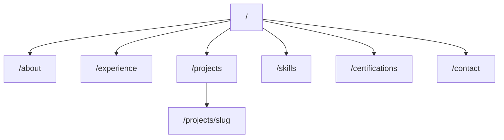

# Ahmad Andika Portfolio — Design Specification

> **Precision Forge** aesthetic · Dark default + light toggle · Static Next.js 16  
> Source: [PRD.md](./PRD.md) · Status: **Phase 1 MVP implemented**

---

## 1. Overview & Goals

### Purpose

Professional portfolio for **Ahmad Andika Khoirul Amin** — a backend and full-stack developer with 5+ years building payment systems, ticketing platforms, automation tools, and business applications.

### Audience

Recruiters, hiring managers, clients, and freelance opportunities. Visitors must understand experience, skills, and projects within **30 seconds**.

### Success Criteria

| Metric | Target |
|--------|--------|
| Load time | < 2 seconds |
| Lighthouse Performance | 95+ |
| Lighthouse Accessibility | 95+ |
| Lighthouse Best Practices | 95+ |
| Lighthouse SEO | 100 |
| CV download | Available from every page (header) |
| Deployment | Vercel |

### Tech Stack

- **Frontend:** Next.js 16 (App Router), TypeScript, Tailwind CSS v4, Shadcn/UI, Lucide Icons
- **Data:** Static TypeScript files in `src/data/`
- **Deployment:** Vercel
- **No API, no backend, no CMS** (Phase 1)

### Sitemap



---

## 2. Aesthetic Direction

### Concept: Precision Forge

Refined **industrial-editorial** direction for a backend systems builder. Warm charcoal base (not cold blue-black), copper-oxide accent (not teal/purple cliché), blueprint grid atmosphere, monospace metrics rails.

| Axis | Choice |
|------|--------|
| Mood | Confident, precise, understated luxury |
| Density | Airy sections, tight data blocks |
| Motion | Restrained — 200–400ms ease-out, no bounce |
| DNA | Linear's grid discipline + Raycast's warm dark + Vercel's typographic hierarchy — **not** their color palettes |

### Differentiation

The hero uses a **split editorial grid**: oversized display headline left, profile photo in a copper-bordered "specimen frame" right, with a **horizontal metrics rail** (mono numerals + hairline dividers) spanning full width below — like a technical dossier, not a startup hero.

### Typography Pairing

| Role | Font | Why |
|------|------|-----|
| Display | **Bricolage Grotesque** | Industrial grotesque, variable opsz, memorable headlines |
| Body | **IBM Plex Sans** | Technical credibility, excellent readability |
| Mono | **IBM Plex Mono** | Tags, dates, metrics, overlines |

### Anti-Patterns

| Avoid | Do Instead |
|-------|------------|
| Geist, Inter, Roboto as primary | Bricolage + IBM Plex |
| Purple/violet gradients | Copper + warm charcoal + phosphor accents |
| `rounded-full` pill buttons | `rounded-md` (8px) industrial buttons |
| Centered hero with gradient orb | Split editorial grid + metrics rail |
| Teal-only accent | Copper primary, phosphor secondary |
| Heavy glassmorphism | Solid surfaces + hairline borders |
| Bounce/spring animations | `ease-out` 250ms transforms |
| Percentage skill bars | 4-dot proficiency indicators |
| Visible "Coming Soon" testimonials | `display: none` until real data |
| Multiple competing accent colors | Copper (action), Phosphor (links), Steel (tags) |

---

## 3. Design Tokens

Tokens are defined in [`src/app/globals.css`](src/app/globals.css). **Light mode** (`:root`) and **dark mode** (`.dark` on `<html>`) share the same token names. Dark is the default; users toggle via `ThemeProvider` (`portfolio-theme` in `localStorage`).

### 3.1 Colors

#### Surfaces (dark — default)

| Token | Hex | Usage |
|-------|-----|-------|
| `--background` | `#0B0C0F` | Page base |
| `--surface-raised` | `#12141A` | Cards, header |
| `--surface-overlay` | `#1A1D26` | Modals, dropdowns, chips |
| `--surface-inset` | `#08090C` | Recessed panels, thumbnails |

#### Foreground (dark)

| Token | Hex | Usage |
|-------|-----|-------|
| `--foreground` | `#EDEFF2` | Primary text |
| `--foreground-muted` | `#8B919C` | Secondary text |
| `--foreground-subtle` | `#5C6370` | Captions, overlines |

#### Accents

| Token | Hex | Usage |
|-------|-----|-------|
| `--accent-copper` | `#D4845A` | CTAs, active nav, key metrics |
| `--accent-copper-hover` | `#E09A72` | Button hover |
| `--accent-copper-muted` | `rgba(212,132,90,0.12)` | Chip backgrounds |
| `--accent-phosphor` | `#3DD6C6` | Links, focus ring, code highlights |
| `--accent-phosphor-muted` | `rgba(61,214,198,0.10)` | Link hover backgrounds |
| `--accent-steel` | `#6B8CAE` | Category tags, inactive chips |

#### Borders

| Token | Value |
|-------|-------|
| `--border-subtle` | `rgba(255,255,255,0.06)` |
| `--border-default` | `rgba(255,255,255,0.10)` |
| `--border-strong` | `rgba(255,255,255,0.16)` |
| `--border-accent` | `rgba(212,132,90,0.35)` |

#### Shadcn Mappings

| Shadcn | Maps To |
|--------|---------|
| `--primary` | `--accent-copper` |
| `--primary-foreground` | `#0B0C0F` |
| `--ring` | `--accent-phosphor` |
| `--card` | `--surface-raised` |
| `--muted-foreground` | `--foreground-muted` |

### 3.2 Typography Scale

| Token | Font | Size | Line-height | Weight | Letter-spacing |
|-------|------|------|-------------|--------|----------------|
| `text-display-xl` | Bricolage | `clamp(2.75rem, 5vw, 4.5rem)` | 1.05 | 600 | `-0.03em` |
| `text-display-lg` | Bricolage | `clamp(2rem, 3.5vw, 3rem)` | 1.1 | 600 | `-0.025em` |
| `text-display-md` | Bricolage | `1.75rem` | 1.15 | 600 | `-0.02em` |
| `text-heading` | Bricolage | `1.25rem` | 1.3 | 600 | `-0.015em` |
| `text-body-lg` | IBM Plex Sans | `1.125rem` | 1.65 | 400 | `0` |
| `text-body` | IBM Plex Sans | `1rem` | 1.6 | 400 | `0` |
| `text-body-sm` | IBM Plex Sans | `0.875rem` | 1.55 | 400 | `0` |
| `text-caption` | IBM Plex Sans | `0.75rem` | 1.5 | 500 | `0.04em` |
| `text-mono-lg` | IBM Plex Mono | `1.5rem` | 1.2 | 500 | `-0.02em` |
| `text-mono` | IBM Plex Mono | `0.8125rem` | 1.4 | 400 | `0` |
| `text-overline` | IBM Plex Mono | `0.6875rem` | 1.3 | 500 | `0.12em` |

**Overline pattern:** `// FEATURED PROJECTS` — mono, uppercase, muted text, `//` prefix in phosphor.

### 3.3 Spacing

Base unit: **4px** (Tailwind default).

| Token | Value | Usage |
|-------|-------|-------|
| Section Y | `96px` / `64px` mobile | Between homepage sections |
| Section Y (hero/CTA) | `128px` / `80px` mobile | Hero, contact CTA |
| Container X | `24px` / `32px` sm / `48px` lg | Horizontal padding |
| Card padding | `24px` / `32px` lg | Card internals |
| Stack SM/MD/LG | `8px` / `16px` / `32px` | Vertical rhythm |

### 3.4 Radius

| Token | Value | Usage |
|-------|-------|-------|
| `--radius-sm` | `4px` | Badges, chips |
| `--radius-md` | `8px` | Buttons, inputs |
| `--radius-lg` | `12px` | Cards |
| `--radius-xl` | `16px` | Hero photo frame |

**Rule:** No `rounded-full` buttons — use `rounded-md`.

### 3.5 Shadows

| Token | Value |
|-------|-------|
| `--shadow-sm` | `0 1px 2px rgba(0,0,0,0.4)` |
| `--shadow-card` | `0 0 0 1px var(--border-subtle), 0 4px 24px rgba(0,0,0,0.35)` |
| `--shadow-elevated` | `0 0 0 1px var(--border-default), 0 8px 40px rgba(0,0,0,0.5)` |

### 3.6 Motion

| Token | Value |
|-------|-------|
| `--ease-out` | `cubic-bezier(0.16, 1, 0.3, 1)` |
| `--duration-fast` | `150ms` |
| `--duration-base` | `250ms` |
| `--duration-slow` | `400ms` |
| `--duration-reveal` | `600ms` |

| Interaction | Spec |
|-------------|------|
| Card hover | `translateY(-2px)`, border → accent, `duration-base` |
| Button hover | Background shift only, no scale |
| Focus | `ring-2 ring-accent-phosphor ring-offset-2 ring-offset-background` |
| Page load | Stagger `opacity 0→1`, `translateY 12px→0`, 80ms stagger |
| Nav underline | Width `0→100%`, copper, `duration-fast` |
| Reduced motion | Disable transforms, keep opacity |

---

## 4. Layout System

### Breakpoints

| Name | Min-width | Container max |
|------|-----------|---------------|
| `sm` | 640px | — |
| `md` | 768px | — |
| `lg` | 1024px | 960px |
| `xl` | 1280px | 1120px |
| `2xl` | 1536px | 1200px |

**Content max-width:** `1200px` (`max-w-[1200px] mx-auto`). Prose: `max-w-[65ch]`.

### Grid

12-column grid at `lg+` with `gap-6 lg:gap-8`.

| Pattern | Columns |
|---------|---------|
| Hero | 7 + 5 split |
| Metrics | 4 equal |
| Featured projects | 2×2 (6 cols each) |
| Project detail | 8 content + 4 sticky sidebar |

### Page Shell

```html
<body class="min-h-screen flex flex-col bg-background">
  <Header />       <!-- sticky, 64px / 56px mobile -->
  <main class="flex-1">{children}</main>
  <Footer />
</body>
```

### Header

- **Position:** `sticky top-0 z-50`
- **Background:** `bg-background/80 backdrop-blur-md border-b border-border-subtle`
- **Layout:** Logo left | Nav center (`md+`) | CV + Hire Me + theme toggle (`md+`)
- **Mobile:** Hamburger → Shadcn Sheet (`min(320px, 85vw)`), nav links + theme toggle + CTAs at bottom
- **Theme toggle:** Sun/Moon icon button; desktop in header, mobile inside Sheet

### Footer

- **Background:** `surface-inset` with top border
- **Layout:** 4-column grid at `lg` (Brand, Nav, Social, CTA)
- **Bottom bar:** `© 2026` mono + "Built with Next.js"

### Breadcrumbs

Every page except home: mono caption row below header with phosphor `/` separators.

---

## 5. Component Catalog

### 5.1 Layout (`src/components/layout/`)

| Component | File | Responsibility |
|-----------|------|----------------|
| `Header` | `header.tsx` | Sticky nav (client), desktop nav, CTAs, theme toggle |
| `MobileNav` | `mobile-nav.tsx` | Sheet menu for `< md` breakpoints |
| `ThemeToggle` | `theme-toggle.tsx` | Sun/Moon theme switch button |
| `ThemeScript` | `theme-script.tsx` | Inline script to prevent theme FOUC |
| `Footer` | `footer.tsx` | 4-column footer, social links, copyright |
| `PageShell` | `page-shell.tsx` | Max-width container with consistent padding |
| `Breadcrumbs` | `breadcrumbs.tsx` | Mono caption trail below header |

### 5.1b Providers (`src/components/providers/`)

| Component | File | Responsibility |
|-----------|------|----------------|
| `ThemeProvider` | `theme-provider.tsx` | Theme context, `localStorage`, `.dark` on `<html>` |

### 5.2 Sections (`src/components/sections/`)

| Component | Used On | Key Spec |
|-----------|---------|----------|
| `Hero` | `/` | Split 7+5 grid, overline, display-xl H1, photo frame 280×320, metrics rail |
| `KeyMetrics` | `/` | 4-column divided panel, mono-lg copper values |
| `FeaturedSkills` | `/` | Horizontal scroll mobile, chip grid desktop |
| `FeaturedProjects` | `/` | 2×2 card grid, `ProjectThumbnail` (real screenshots or gradient fallback) |
| `ProjectThumbnail` | `/projects`, `/` | `next/image` when path is not a placeholder |
| `ContactChannelCard` | `/contact` | Split contact layout channel cards |
| `ExperiencePreview` | `/` | 3 stacked cards, copper left border |
| `Testimonials` | `/` | Hidden until data exists |
| `ContactCTA` | `/`, `/experience` | Copper radial glow, centered CTAs |
| `Timeline` | `/experience` | Vertical track, copper nodes, sticky year labels |
| `ProjectCard` | `/projects` | List row at lg, category badge, hover lift |
| `SkillGroup` | `/skills` | Category overline, 4-dot proficiency grid |
| `SectionHeading` | All sections | Overline + display-md title + optional link |

### 5.3 UI (`src/components/ui/`)

Shadcn primitives: `button`, `card`, `badge`, `separator`, `sheet`.

| Extension | Notes |
|-----------|-------|
| Button | `rounded-md`, copper primary, outline secondary |
| Card | `shadow-card`, `rounded-lg`, hover lift |
| Badge | `rounded-sm`, copper-muted or steel variants |

---

## 6. Page Specifications

### `/` — Home

| # | Section | Background | Notes |
|---|---------|------------|-------|
| 1 | Hero | Blueprint grid + copper glow | Metrics rail: 5+ years, 8+ experiences, 50+ clients |
| 2 | ExperiencePreview | `background` | VIPayment, Saytix, IDEVCORNER |
| 3 | FeaturedSkills | `background` | Chips: Laravel, PHP, Node.js, NestJS, MySQL, PostgreSQL, Docker, React |
| 4 | FeaturedProjects | `surface-raised` | VIPayment, Saytix, Notifay, Deratopup (real screenshots) |
| 5 | ContactCTA | `surface-raised` | "Let's Build Something Great Together" |
| — | Testimonials | Hidden | Not rendered until real data |

**Metadata:**
- Title: `Ahmad Andika Khoirul Amin | Backend & Full-Stack Developer`
- Description: PRD subheadline

### `/about`

- Display-lg "About Me" + breadcrumb
- `lg:grid-cols-12`: photo `col-span-4` sticky, content `col-span-8`
- Sections: Introduction, Professional Summary, Education, Career Journey
- Sidebar: Quick facts (location, years, focus areas)

### `/experience`

- "Work Experience" + years badge (copper pill)
- Full `Timeline` component, `max-w-3xl` centered
- Optional filter chips: All / Backend / Full-stack
- Condensed `ContactCTA` at bottom

### `/projects`

- "Projects" + count mono
- Category filter chips (Payment, Ticketing, WhatsApp, POS, E-Commerce, Automation, SaaS)
- List view default at `lg`, grid toggle optional
- Empty state: mono message + phosphor contact link

### `/projects/[slug]`

Example: `/projects/saytix-ticketing`

| Section | Content |
|---------|---------|
| Hero band | Name, category, role, year — full bleed `surface-raised` |
| Overview | Project summary |
| Problem | Business/technical challenge |
| Solution | Approach taken |
| Architecture | Screenshot `aspect-[16/10]` when available; gradient placeholder otherwise |
| Responsibilities | Bullet list |
| Results | Metric callouts with copper left border |
| Sidebar | Country, tech stack, challenges, **Related** project links |
| Prev/Next | Bottom border row, mono names |

**Slug convention:** kebab-case from project name (e.g., `saytix-ticketing`, `vipayment`, `notifay`).

### `/skills`

- "Technical Skills" + proficiency legend (4-dot key)
- `SkillGroup` per category: Backend, Frontend, Database, DevOps
- Footer: "Always learning" mono italic

### `/certifications`

- Grid `1/2/3` columns
- Card: issuer logo 48px, title, date mono, credential link phosphor
- Issuers: Dicoding, SantriKoding, Udemy, HackerRank, SoloLearn, SMKDEV

### `/contact`

- No form — split layout with `ContactChannelCard` components
- Channels: Email, Phone, Location, LinkedIn, GitHub
- Sidebar: Hire Me + Download CV, response-time caption
- Social icons use text monograms (Lucide brand icons unavailable)
- Contact via `mailto:` and external links only

---

## 7. Data Model

Defined in [`src/types/index.ts`](src/types/index.ts).

### Profile (`src/data/profile.ts`)

```typescript
interface Profile {
  name: string;
  title: string;
  headline: string;
  subheadline: string;
  summary: string;
  email: string;
  phone: string;
  linkedin: string;
  github: string;
  location: string;
  yearsExperience: number;
  cvPath: string;        // /cv/AHMAD_ANDIKA_KHOIRUL_AMIN_FULLSTACK_DEVELOPER.pdf
  photoPath: string;     // /profile/profile.png
  education: Education[];
  careerJourney: string;
}
```

### Experience (`src/data/experience.ts`)

```typescript
interface Experience {
  id: string;
  company: string;
  position: string;
  period: string;
  startDate: string;     // ISO date for sorting
  endDate: string | null;
  responsibilities: string[];
  techStack: string[];
  achievements: string[];
}
```

### Project (`src/data/projects.ts`)

```typescript
type ProjectCategory =
  | "Payment Platform" | "Ticketing System" | "WhatsApp Gateway"
  | "POS" | "E-Commerce" | "Automation" | "SaaS";

interface Project {
  slug: string;
  name: string;
  category: ProjectCategory;
  description: string;
  role: string;
  period: string;
  country: string;
  techStack: string[];
  challenges: string[];
  results: string[];
  overview: string;
  problem: string;
  solution: string;
  architecture: string;
  responsibilities: string[];
  thumbnailPath: string;   // /portofolio/{name}.png or placeholder
  galleryPaths: string[];
  links: { live?: string; github?: string };
  relatedSlugs?: string[];  // cross-links on detail sidebar
  featured: boolean;
}
```

### Certification (`src/data/certifications.ts`)

```typescript
interface Certification {
  id: string;
  title: string;
  issuer: string;
  date: string;
  credentialUrl?: string;
}
```

### Skills (`src/data/skills.ts`)

```typescript
interface Skill {
  name: string;
  proficiency: 1 | 2 | 3 | 4;  // 4-dot indicator
}

interface SkillCategory {
  id: string;
  name: string;  // Backend, Frontend, Database, DevOps
  skills: Skill[];
}
```

### Featured Content References

| Data | IDs/Slugs |
|------|-----------|
| Key metrics | 5+ years, 8+ work experiences, 50+ clients |
| Featured skills | Laravel, PHP, Node.js, NestJS, MySQL, PostgreSQL, Docker, React |
| Featured projects | `vipayment`, `saytix-ticketing`, `notifay`, `deratopup` |
| Related projects | `vipayment-v2` ↔ `vipayment`, `game-top-up-platform` ↔ `deratopup` |
| Experience preview | VIPayment, Saytix, IDEVCORNER |

---

## 8. SEO & Structured Data

Helpers in [`src/lib/seo.tsx`](src/lib/seo.tsx).

### Per-Route Metadata

Every page exports `metadata` via `createPageMetadata()` with:

- `title`, `description`, `keywords`
- Open Graph (title, description, url, image 1200×630)
- Twitter Card (`summary_large_image`)
- Canonical URL

### JSON-LD Schemas

| Schema | Where | Content |
|--------|-------|---------|
| `Person` | Root layout | Name, url, jobTitle, sameAs (LinkedIn, GitHub) |
| `WebSite` | Root layout | Site name, url |
| `BreadcrumbList` | All pages except `/` | Home → current page |

### Environment

```
NEXT_PUBLIC_SITE_URL=https://ahmadandika.dev
```

---

## 9. Accessibility & Performance

### Accessibility

- Semantic HTML (`header`, `main`, `footer`, `nav`, `section`)
- Proper heading hierarchy (one `h1` per page)
- Keyboard navigation for all interactive elements
- Focus rings: phosphor `ring-2`
- Alt text on all images
- Contrast: copper on `#0B0C0F` ≥ 4.5:1; phosphor links ≥ 4.5:1
- `prefers-reduced-motion` respected

### Performance

- `next/image` for all photos/screenshots
- `priority` only on hero profile photo
- Lazy load gallery and project thumbnails
- Static generation for all routes + `generateStaticParams` for projects
- No animated gradients, canvas, or WebGL
- Noise overlay as static SVG tile

### Lighthouse Checklist

- [ ] No layout shift from fonts (next/font)
- [ ] Images have explicit width/height
- [ ] Meta description on every page
- [ ] `<html lang="en">`
- [ ] Tap targets ≥ 44px on mobile
- [ ] No render-blocking third-party scripts

---

## 10. Asset Requirements

| Asset | Path | Spec |
|-------|------|------|
| Profile photo | `/public/profile/profile.png` | Portrait, specimen frame in hero |
| CV PDF | `/public/cv/AHMAD_ANDIKA_KHOIRUL_AMIN_FULLSTACK_DEVELOPER.pdf` | Downloadable from header |
| Project screenshots | `/public/portofolio/` | `vipayment.png`, `vipayment-public.png`, `saytix.png`, `deratopup.png`, `topup-game.png` |
| Legacy placeholders | `/public/images/projects/` | Used when `thumbnailPath` contains `placeholder` |
| OG default image | `/public/images/og-default.jpg` | 1200×630px |
| Noise texture | `/public/noise.svg` | 200×200 tile (optional) |

---

## 11. Background & Atmosphere

### Blueprint Grid

Applied to hero only via `.bg-blueprint .bg-blueprint-fade` — fades out below 60%.

### Film Grain

Optional `body::after` with `/noise.svg` at `opacity: 0.025`, `pointer-events: none`.

### Radial Glows

| Location | Gradient |
|----------|----------|
| Hero top-right | `ellipse 600px 400px at 85% 15%, var(--glow-copper), transparent` |
| Contact CTA | `ellipse 500px 300px at 50% 0%, var(--glow-copper), transparent` |
| Project detail | `ellipse 400px 300px at 20% 50%, var(--glow-phosphor), transparent` |

---

## 12. Implementation Phases

### Phase 1 — MVP (Complete)

- All 8 routes with static data populated from CV
- Homepage: Hero → Experience → Skills → Projects → Contact CTA
- SEO metadata + JSON-LD
- Responsive design with mobile Sheet navigation
- Dark/light theme toggle (`ThemeProvider` + `ThemeScript`)
- Real project screenshots in `/public/portofolio/`
- Related project cross-links on detail pages
- CV download in header on every page

### Phase 2 — Out of Scope

Blog, expanded case studies, resume timeline animation, GitHub widget, EN/ID i18n.

### Phase 3 — Out of Scope

CMS integration, analytics dashboard, contact form backend, newsletter.

---

## 13. File Map

| PRD Requirement | Source File(s) |
|-----------------|----------------|
| Profile data | `src/data/profile.ts` |
| Experience | `src/data/experience.ts` |
| Projects | `src/data/projects.ts` |
| Certifications | `src/data/certifications.ts` |
| Skills | `src/data/skills.ts` |
| Type definitions | `src/types/index.ts` |
| SEO helpers | `src/lib/seo.tsx` |
| Design tokens | `src/app/globals.css` |
| Root layout | `src/app/layout.tsx` |
| Homepage | `src/app/page.tsx` |
| About | `src/app/about/page.tsx` |
| Experience page | `src/app/experience/page.tsx` |
| Projects list | `src/app/projects/page.tsx` |
| Project detail | `src/app/projects/[slug]/page.tsx` |
| Skills | `src/app/skills/page.tsx` |
| Certifications | `src/app/certifications/page.tsx` |
| Contact | `src/app/contact/page.tsx` |
| Header | `src/components/layout/header.tsx` |
| Mobile nav | `src/components/layout/mobile-nav.tsx` |
| Theme toggle | `src/components/layout/theme-toggle.tsx` |
| Theme script | `src/components/layout/theme-script.tsx` |
| Theme provider | `src/components/providers/theme-provider.tsx` |
| Footer | `src/components/layout/footer.tsx` |
| Page container | `src/components/layout/page-shell.tsx` |
| Project thumbnail | `src/components/sections/project-thumbnail.tsx` |
| Homepage sections | `src/components/sections/*.tsx` |
| Shadcn UI | `src/components/ui/*.tsx` |

---

## Changelog

| Date | Change |
|------|--------|
| 2026-06-12 | Phase 1 MVP implemented; theme toggle, mobile nav, project screenshots, homepage reorder |
| 2026-06-12 | Project portfolio: VIPayment (reseller) + v2 (public), Deratopup + Game Top-Up Suite |
